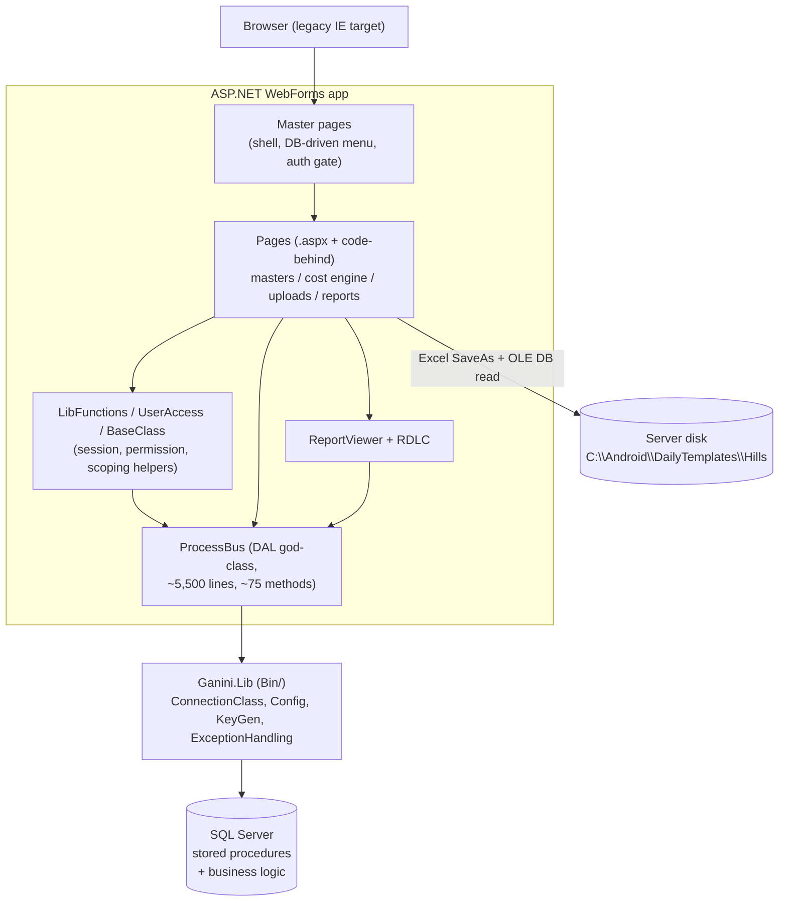
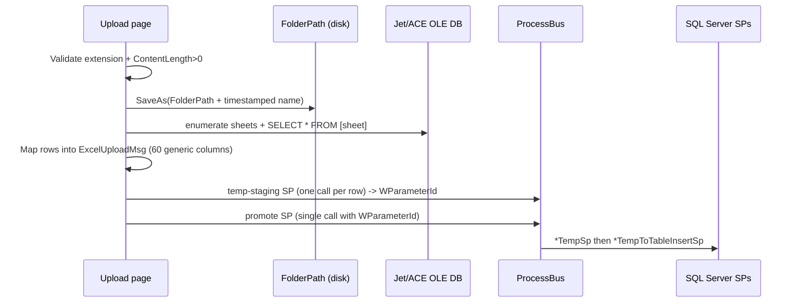

# Hills International "Tender Insight System" (TIS) - Reference & Audit Document

> Single-source reference for the Hills International TIS web application. It documents each
> major subsystem and audits it across six dimensions: **Accessibility, UX, UI, Business Logic,
> Refactorability, and Architecture**. Each dimension records the *current state*, concrete
> *findings/issues*, and *recommendations*.
>
> Scope: everything under `HillsInternational/Hills/`. This document is descriptive of the code
> as it exists today; file/line citations are provided so findings can be verified.

---

## Table of contents

1. [Overview & purpose](#1-overview--purpose)
2. [Technology stack](#2-technology-stack)
3. [High-level architecture](#3-high-level-architecture)
4. [Repository layout](#4-repository-layout)
5. [Cross-cutting concerns](#5-cross-cutting-concerns)
6. Subsystems
   - [6.1 Presentation shell & navigation](#61-presentation-shell--navigation)
   - [6.2 Authentication, roles & permissions](#62-authentication-roles--permissions)
   - [6.3 Master data management](#63-master-data-management)
   - [6.4 Tender / IOW / CRAM cost-estimation engine](#64-tender--iow--cram-cost-estimation-engine-core-domain)
   - [6.5 Excel upload & data import pipeline](#65-excel-upload--data-import-pipeline)
   - [6.6 Reporting](#66-reporting)
   - [6.7 Data access & business layer](#67-data-access--business-layer)
7. [Global findings & prioritized recommendations](#7-global-findings--prioritized-recommendations)

---

## 1. Overview & purpose

The Hills International TIS is a **construction tender cost-estimation and insight** web
application. Its core workflow is:

- Clients issue a **tender** (a BOQ - Bill of Quantities - of line items: serial no, description,
  unit of measure, quantity, rates). These are imported from Excel.
- Each tender line is mapped to internal **IOW (Item of Work)** cost codes, which are organized
  in a **CRAM** Group / SubGroup hierarchy (the internal cost catalog).
- **IOW rates** are calculated per region and per year-month, and rolled up to produce an
  estimated cost for the tender.
- Results are surfaced through **RDLC reports** (tender listings, quote history, comparisons,
  IOW cost listings, item rate reports).

The application is branded in the UI as *"Tender Insight System"* (see the version banner set in
[`MasterPage.master.cs`](MasterPage.master.cs) line 15).

Around this core sit the usual supporting subsystems: authentication/roles, master-data CRUD
pages (company, client, employee, item, CRAM, project sector masters, etc.), a bulk Excel upload
pipeline, and reporting.

---

## 2. Technology stack

| Layer | Technology |
|---|---|
| UI | ASP.NET **WebForms** (`.aspx` + `.master`), server controls, `asp:GridView`, `asp:Menu` |
| Runtime | .NET Framework **4.0** (`Web.config` `targetFramework="4.0"`, `debug="true"`) |
| Language | C# (code-behind `.aspx.cs`) |
| Client libraries | jQuery 1.9.1 + `jquery.backstretch`, Bootstrap (min), Font Awesome (in `JS/`, `CSS/`) |
| Data access | Custom DAL class `ProcessBus` calling **SQL Server stored procedures** via `Ganini.Lib.ConnectionClass` |
| Reporting | **Microsoft ReportViewer 10 + local RDLC** (active); Crystal Reports (configured but vestigial) |
| Excel import | **OLE DB** (`Microsoft.Jet.OLEDB.4.0` for `.xls`, `Microsoft.ACE.OLEDB.12.0` for `.xlsx`) |
| Third-party assembly | `Ganini.Lib` / `Ganini.Security` / `Ganini.Diagnostics` (in `Bin/`) - shared Ganini framework: `Config`, `ConnectionClass`, `ExceptionHandling`, `Validation`, `KeyGen` |
| Mail | `System.Net.Mail.SmtpClient` (config-driven), plus a legacy `MailingClass` |

> Note: `Web.config` still targets IE via `<meta http-equiv="X-UA-Compatible" content="IE=EmulateIE7" />`
> in every master page - the app was built for legacy Internet Explorer.

---

## 3. High-level architecture

The application is a classic **2-tier WebForms** app: pages (UI + orchestration in code-behind)
talk to a single data-access class (`ProcessBus`) which calls SQL Server stored procedures. Most
business logic lives **inside the stored procedures**, not in C#.



**Excel upload flow** (two-phase staging):



---

## 4. Repository layout

```
HillsInternational/Hills/
├── *.aspx / *.aspx.cs        ~50 pages (masters, cost engine, uploads, reports, auth)
├── MasterPage.master(.cs)    Login shell (no nav)
├── MasterPage1.master(.cs)   Authenticated shell with DB-driven menu
├── MasterPage3.master(.cs)   Upload/project-input shell (purple content area)
├── MasterHillOrig_bakup/     Backup copies of the three master pages
├── Web.config                Config, connection strings, appSettings, URL rewrite
├── App_Code/
│   ├── BusinessLayer/
│   │   └── ProcessBus.cs      Monolithic DAL (~5,500 lines, ~75 SP-calling methods)
│   ├── MessageLayer/          DTO / "message" classes + BaseClass (session) + UserPermission
│   │   ├── BaseClass.cs       Session-backed identity/permission state
│   │   ├── UserPermission.cs  UserAccess.HasPermission(...) RBAC checks
│   │   ├── ExcelUploadMsg.cs  60 generic string columns for upload staging
│   │   └── *Msg.cs            Per-entity DTOs (Company, Employee, Report, etc.)
│   ├── Library/LibFunctions.cs  Presentation helpers (company/employee/client scoping)
│   ├── MailingClass.cs        Legacy SMTP utility (namespace GeneratingMail)
│   ├── GridViewExportUtil.cs  HTML-to-Excel grid exporter (currently unused)
│   └── ClassDiagram.cd
├── Reports/
│   ├── TenderReports/*.rdlc   Tender listing / quote history / comparison
│   └── CRAM/*.rdlc            IOW cost listing / summary / item rate
├── CSS/                       bootstrap, font-awesome, scs.css, style.css, ... + Excluded/ (dead pages)
├── JS/                        jquery, jquery.backstretch, bootstrap.min
├── Images/, fonts/, Document/
├── Mobile/                    Separate mobile Default page + Mobile.master
├── App_Data/, App_GlobalResources/, App_WebReferences/
└── Bin/                       Ganini.* and third-party assemblies
```

Note the presence of dead/backup artifacts: `CSS/Excluded/*.exclude`, `MasterHillOrig_bakup/`,
`Copy of *.rdlc`, and numerous `*.rdlc.exclude` files - these are historical clutter.

---

## 5. Cross-cutting concerns

These behaviors recur across every subsystem and are referenced throughout section 6.

- **Identity / session** - `App_Code/MessageLayer/BaseClass.cs` wraps `Session[...]` values
  (`EmployeeCode`, `CompanyId`, `IsAdmin`, `IsSuperUser`, `ProgramMsgList`, etc.). Pages inherit
  from `BaseClass` or instantiate it. Session mode is **InProc** with an effectively unlimited
  timeout: `<sessionState mode="InProc" timeout="50000"/>` ([`Web.config`](Web.config) line 74).
- **RBAC** - `App_Code/MessageLayer/UserPermission.cs` exposes `UserAccess.HasPermission(program, permission)`.
  Permissions are loaded once per session into `Session["ProgramMsgList"]` from
  `AdmUserAccessProgramsSelectSp` and checked per action (CanCreate/CanEdit/CanDelete/CanPrint).
- **Data access** - all DB access funnels through `ProcessBus` -> stored procedures. Queries are
  **parameterized** (`AddWithValue`), so classic SQL injection is largely mitigated.
- **Config & secrets** - `Web.config` contains **plaintext DB credentials** (lines 24-25) and
  **plaintext SMTP credentials** (line 61), hard-coded absolute machine paths (`D:\LogFile`,
  `E:\Source Code\...`, `C:\Android\DailyTemplates\Hills\`), and `debug="true"` (line 75).
  `<directoryBrowse enabled="true"/>` (line 131) is also enabled.
- **Error handling / user feedback** - almost all validation and error feedback is a JavaScript
  `alert()` injected via `ScriptManager.RegisterStartupScript`. Server exceptions go through
  `Ganini.Lib.ExceptionHandling` (file/DB trace listeners configured in `Web.config`).
- **Time** - timestamps use `DateTime.UtcNow.AddMinutes(330)` (IST offset hard-coded) throughout.
- **Legacy browser hardening** - master pages set `IE=EmulateIE7`, disable right-click
  (`oncontextmenu="return false"`), disable the browser Back button via JS, and (on the login
  master) periodically clear the clipboard.

---

## 6. Subsystems

Each subsystem below is audited across the six requested dimensions. A dimension marked *N/A*
means it does not meaningfully apply (e.g. Accessibility for a pure server-side data layer).

---

### 6.1 Presentation shell & navigation

**What it is:** the three master pages that frame every screen, plus shared presentation helpers.

**Key files:** [`MasterPage.master`](MasterPage.master) (login), [`MasterPage1.master`](MasterPage1.master)
(authenticated app), [`MasterPage3.master`](MasterPage3.master) (uploads), their `.cs` files,
[`App_Code/Library/LibFunctions.cs`](App_Code/Library/LibFunctions.cs),
[`App_Code/GridViewExportUtil.cs`](App_Code/GridViewExportUtil.cs), and `CSS/`, `JS/`.

**How navigation works:** the menu is **role-based and DB-driven**. On first (non-postback) load,
`MasterPage1.master.cs` calls `Bus.AdmUserAccessProgramsSelect(emp)` -> `AdmUserAccessProgramsSelectSp`,
stores the result in `Session["ProgramMsgList"]`, and builds a 3-level `asp:Menu`
(`MainMenu` / `SubMenu` / `ChildMenu`) via `LoadMenu(...)` (lines 66-89, 127-130). Auth gating
is done here too: if `EmployeeName` is empty the user is redirected to `Login.aspx?IsSessionTimeOutFlag=Y`
(lines 53-56).

#### Accessibility
- *Current state:* HTML is XHTML 1.0 Transitional; layout is built with nested `<table>` elements
  and fixed pixel widths (header `1286px`, menu `95px`, content `~1250px`). Navigation is an
  `asp:Menu` with no ARIA landmarks.
- *Findings:* `IE=EmulateIE7` forces legacy rendering; `oncontextmenu="return false"` disables the
  right-click context menu (blocks assistive/context features); the Back button is disabled via JS
  with a visible "Back button Disabled" label; no skip-link, no `<nav>`/`<main>` landmarks, no
  `lang` beyond defaults, and low-contrast menu colors in places. Small font classes
  (`X-Small`, `XX-Small`) are pervasive.
- *Recommendations:* drop IE emulation, re-implement layout with semantic HTML + CSS grid/flex,
  add ARIA landmarks and a skip-to-content link, stop hijacking the Back button and context menu,
  and audit color contrast to WCAG AA.

#### UX
- *Current state:* consistent shell across screens (header with app/version banner, collapsible
  left menu, Home/Logout links, user name + date). Menu collapses via `Menu -` / `Menu +`.
- *Findings:* disabling Back/right-click and clearing the clipboard are hostile to normal browser
  usage. Fixed-width layout means horizontal scrolling on smaller displays. Session timeout of
  50000 minutes means users effectively never re-auth, but a real timeout surfaces only as a
  redirect with a query-string flag.
- *Recommendations:* allow normal browser navigation, make the shell responsive, and give a clear
  in-page session-expiry message rather than relying on `alert()`/redirect.

#### UI
- *Current state:* Bootstrap + Font Awesome are referenced, but layout is largely inline styles
  and per-master `<style>` blocks with magic pixel classes (`.style21`, `.style27`, ...).
  `MasterPage3` differs only by a purple content background (`#e8d6f6`).
- *Findings:* three near-duplicate master pages plus a `MasterHillOrig_bakup/` copy = 4x
  maintenance. Styling is inconsistent (inline vs class vs Bootstrap). Hard-coded widths break
  on any non-desktop viewport.
- *Recommendations:* consolidate to a single parameterized master (or a base master + thin
  variants), move inline styles into a shared stylesheet, and adopt the Bootstrap grid already
  present.

#### Business logic
- *Current state:* the shell contains real logic - menu construction, permission loading, auth
  gating, and logout (which calls `AdmUserLogOffInfoSp`). `LibFunctions` scopes companies/employees/
  clients by `IsAdmin` (admins see all; others see only their own company).
- *Findings:* `LoadMenu` hardcodes up to 9 top-level slots (`Menu1`..`Menu9`) - a silent cap on
  menu breadth. Auth/menu logic is duplicated between `MasterPage1` and `MasterPage3`.
- *Recommendations:* extract shared shell logic into a common base `MasterPage` class; make the
  menu fully data-driven without a fixed slot count.

#### Refactorability
- *Current state:* logic is spread across two nearly identical master code-behinds.
- *Findings:* copy-paste duplication (masters + backup folder), fixed slot counts, presentation
  and data-loading intermixed.
- *Recommendations:* introduce a `BaseMaster` for menu/auth; delete `MasterHillOrig_bakup/` and
  `CSS/Excluded/` after confirming they are unused.

#### Architecture
- *Current state:* master pages orchestrate identity, navigation, and per-request auth - a
  reasonable place for cross-cutting shell concerns in WebForms.
- *Findings:* auth-by-master means any page that does **not** use `MasterPage1`/`MasterPage3`
  (e.g. `Login.aspx` on `MasterPage.master`) is ungated. There is no central HTTP module / global
  authorization filter.
- *Recommendations:* enforce authentication centrally (an `IHttpModule` or `Global.asax` hook, or
  migrate to ASP.NET Forms/Identity authorization) so gating is not dependent on which master a
  page happens to inherit.

> `GridViewExportUtil` (HTML-to-Excel export of a `GridView`/`DataGrid`) lives here but appears
> **unused** in the project - a candidate for removal or wiring into report/grid screens.

---

### 6.2 Authentication, roles & permissions

**What it is:** login/logout, password management, and role-to-program permission assignment.

**Key files:** [`Login.aspx`](Login.aspx)/[`.cs`](Login.aspx.cs),
[`LoginUser.aspx.cs`](LoginUser.aspx.cs), [`ForgotPassword.aspx.cs`](ForgotPassword.aspx.cs),
[`ChangePassword.aspx.cs`](ChangePassword.aspx.cs), [`Roles.aspx`](Roles.aspx),
[`AssignUserRoles.aspx.cs`](AssignUserRoles.aspx.cs),
[`AssignProgramtoRoles.aspx.cs`](AssignProgramtoRoles.aspx.cs),
[`App_Code/MessageLayer/BaseClass.cs`](App_Code/MessageLayer/BaseClass.cs),
[`App_Code/MessageLayer/UserPermission.cs`](App_Code/MessageLayer/UserPermission.cs).

**How login works:** `btnLogin_Click` validates non-empty fields, encrypts the password with
`Ganini.Security.KeyGen.EncryptPwd(...)`, and calls `Bus.CheckLogin` -> `AdmChkLoginSp`
([`Login.aspx.cs`](Login.aspx.cs) lines 47-62; [`ProcessBus.cs`](App_Code/BusinessLayer/ProcessBus.cs)
lines 4148-4186). On success (`Result == "0"|"1"`), user context is written to session via
`BaseClass` setters and the user is redirected to `Default.aspx` (lines 63-75). Logout clears the
session and calls `AdmUserLogOffInfoSp` ([`MasterPage1.master.cs`](MasterPage1.master.cs) lines 470-478).

**Permissions:** `UserAccess.HasPermission(program, permission)` filters the cached
`ProgramMsgList` where `ProgramAccessPath.Contains(ProgramName)` and returns the relevant
CanCreate/CanEdit/CanDelete/CanPrint flag ([`UserPermission.cs`](App_Code/MessageLayer/UserPermission.cs)
lines 31-48). `AssignProgramtoRoles.aspx` edits the role x program matrix; `AssignUserRoles.aspx`
assigns roles to users; `Roles.aspx` is a placeholder ("Under Construction").

#### Accessibility
- *Current state:* login is a fixed-width nested-table form with `Placeholder` text on the
  username/password boxes.
- *Findings:* labels (`lblUserName`, `lblPwd`) have **no `AssociatedControlID`**, so screen
  readers cannot associate them with inputs; controls are tiny (`height="15px"`, button
  `56x20px`); errors appear only as JS `alert()` with no live region.
- *Recommendations:* associate labels with inputs, provide an accessible inline error region,
  increase control/touch-target sizes.

#### UX
- *Current state:* single login screen with an inline "Forgot Password" link that reuses the
  username field; a separate `ForgotPassword.aspx` also exists (but it inherits `MasterPage1`,
  which requires an existing login - a contradiction).
- *Findings:* all feedback is blocking `alert()`; session-timeout is communicated via
  `?IsSessionTimeOutFlag=Y`; forgot-password legacy path historically emailed the password in
  cleartext.
- *Recommendations:* unify forgot-password into one accessible flow that does **not** email
  passwords; replace alerts with inline messages.

#### UI
- *Current state:* branded login panel (`1286px` wide), backstretch background image.
- *Findings:* not responsive; inconsistent control sizing; the login page uses `MasterPage.master`
  (no nav) which is appropriate, but shares the same legacy hardening.
- *Recommendations:* responsive, centered card layout; consistent form styling.

#### Business logic
- *Current state:* auth result codes (`"0"`/`"1"`) drive session population; password changes
  encrypt both old and new values before `AdmChangePaswordUpdateSp`
  ([`ChangePassword.aspx.cs`](ChangePassword.aspx.cs) lines 64-71). RBAC is enforced per action
  in page code-behind.
- *Findings (security-critical):*
  - Passwords use **reversible encryption** (`KeyGen.EncryptPwd`, with a decrypt key referenced
    in `Login.aspx.cs`), **not** one-way hashing (bcrypt/Argon2/PBKDF2).
  - **No session-fixation protection** - no `Session.Abandon()`/ID regeneration on login.
  - **No page-level `CanAccess` gate** - once logged in, any page loads; only Create/Edit/Delete
    buttons are permission-checked, and some `RowDeleting` handlers act without re-checking
    permission (UI-only hiding).
  - `HasPermission` reads `list[0]` without an empty-check (IndexOutOfRange risk) and uses a
    substring `Contains` match on program paths (possible false matches).
  - `LoginUser.aspx.cs` loads the stored password back into a textbox on edit.
  - `BaseClass.UserId` getter dereferences `Session["UserId"]` (never set in the login flow) and
    its setter writes the `EmployeeCode` key - a latent bug.
- *Recommendations:* migrate to salted one-way password hashing; regenerate session on login;
  add a central `CanAccess` gate per page; harden `HasPermission` (exact match + empty-list guard);
  never round-trip passwords to the UI.

#### Refactorability
- *Current state:* auth logic is spread across page code-behinds, `BaseClass`, `UserPermission`,
  and `ProcessBus`.
- *Findings:* duplicated permission-check + alert patterns on every page; `Roles.aspx` is a stub.
- *Recommendations:* centralize auth in a service; consider replacing the custom scheme with
  ASP.NET Identity / Forms Authentication + a role provider.

#### Architecture
- *Current state:* custom session-based auth with a DB-backed RBAC model (program access paths +
  CRUD flags).
- *Findings:* no framework auth pipeline; gating depends on the master page; secrets in config.
- *Recommendations:* adopt a standard auth pipeline; externalize secrets (see section 7).

---

### 6.3 Master data management

**What it is:** CRUD screens for reference/master data (company, client, employee, item and item
category/subcategory/group, state, CRAM masters, project sector masters, financial year, IOW
common factor, enterprise).

**Key files (representative):** [`CompanyMaster.aspx`](CompanyMaster.aspx)/[`.cs`](CompanyMaster.aspx.cs),
[`ClientMaster.aspx.cs`](ClientMaster.aspx.cs), [`EmployeeMaster.aspx.cs`](EmployeeMaster.aspx.cs),
[`ItemMaster.aspx.cs`](ItemMaster.aspx.cs), [`StateMaster.aspx.cs`](StateMaster.aspx.cs).

**Common pattern:** each page declares `ProcessBus Bus`, `UserAccess user`, `BaseClass`, and a
`static string ProgramName`. `Page_Load` sets `ProgramName = Path.GetFileName(Request.PhysicalPath)`,
loads a `GridView` with `Flag = "R"`, then hides Edit/Delete columns based on permission. Two edit
styles exist:
- **Inline grid** (Company, Employee, State): edit/delete via `GridView` `CommandField` ->
  `RowUpdating` (`Flag="U"`) / `RowDeleting` (`Flag="D"`); add via a bottom panel (`Flag="I"`).
- **Form swap** (Client, Item): `RowCommand` copies the row into a form panel, `btnSave` toggles
  between "Save" (`Flag="I"`) and "Update" (`Flag="U"`).

All variants call a single `ProcessBus` method per entity, e.g.
`Bus.MasStateInsertUpdateandDelete(State)` where `State.Flag` selects the operation
([`StateMaster.aspx.cs`](StateMaster.aspx.cs) lines 61-87).

#### Accessibility
- *Current state:* forms and grids laid out with `<table>` and fixed widths; labels lack
  `AssociatedControlID`; no ARIA.
- *Findings:* small fonts, tiny controls, and `alert()`-only validation feedback throughout.
- *Recommendations:* associate labels, add accessible validation summaries, and use responsive
  layout for the grids.

#### UX
- *Current state:* consistent "grid on top, form below/swapped-in" pattern; success/error via `alert()`.
- *Findings:* no client-side validation, so users only learn of errors after a postback + alert;
  the active/`chkIsActive` flag is hidden on add and only editable on update (surprising); some
  delete controls are hidden in markup rather than governed by permission.
- *Recommendations:* add inline validation, make the active flag explicit, standardize the
  add/edit/delete affordances.

#### UI
- *Current state:* `overflow:auto` fixed-height/width panels (e.g. `CompanyMaster` grid panel
  `1050x274px`); inline styles everywhere.
- *Findings:* every master page reinvents the same layout with slightly different magic numbers.
- *Recommendations:* extract a shared "master CRUD" user control / template with consistent
  styling.

#### Business logic
- *Current state:* validation is manual server-side (`IsValidSave`/`IsValidGridSave` returning an
  `int` error count and concatenating messages); operation is chosen by the DTO `Flag`; the SP
  performs the actual persistence and rules. `EmployeeMaster` encrypts the password only on insert.
- *Findings:* **shared mutable static state** - pages use `public static` lists and indices (e.g.
  `DeleteIndex`, `ClientList`) at class scope, which are shared across **all users/sessions** in
  the app domain (a real concurrency/correctness bug). Validation is duplicated and inconsistent
  (some redundant `Convert.ToInt32(x.Length)` checks). Delete handlers may not re-check
  `CanDelete`.
- *Recommendations:* eliminate all `public static` page state (use instance fields, ViewState, or
  session-scoped state); centralize validation; enforce permission inside every mutating handler.

#### Refactorability
- *Current state:* ~15 master pages, each a near-clone.
- *Findings:* heavy copy-paste (declarations, `Page_Load`, permission column hiding, save/clear,
  alert plumbing). `ClientMaster` and `ItemMaster` are especially similar.
- *Recommendations:* build a generic master-data base page or a reusable grid/form control
  parameterized by entity + `ProcessBus` method; this would remove the bulk of the duplication.

#### Architecture
- *Current state:* thin UI -> `ProcessBus` -> SP; DTOs per entity in `MessageLayer`.
- *Findings:* no service/repository abstraction; business rules live in SPs (opaque to the app).
- *Recommendations:* introduce a repository/service layer boundary so validation and rules are
  testable in C#.

---

### 6.4 Tender / IOW / CRAM cost-estimation engine (core domain)

**What it is:** the heart of the product - mapping tender BOQ lines to IOW cost codes and computing
estimated costs per region and year-month.

**Key files:** [`TenderIOWMapping.aspx.cs`](TenderIOWMapping.aspx.cs) (~938 lines),
[`TenderIOWMappingCost.aspx.cs`](TenderIOWMappingCost.aspx.cs) (~321 lines),
[`CRAMIOWCostCalculation.aspx.cs`](CRAMIOWCostCalculation.aspx.cs) (~175 lines),
[`A_ProjectInputIOWCostCalculation.aspx.cs`](A_ProjectInputIOWCostCalculation.aspx.cs) (~284 lines),
[`A_ProjectInputSheet.aspx.cs`](A_ProjectInputSheet.aspx.cs) (~1319 lines).

**Where the logic lives:** UI + orchestration in code-behind; thin SP wrappers in `ProcessBus`;
**actual cost math in stored procedures** (`TenderIOWMappingCostSp`, `A_IOWRateInsertSp`,
`A_ProjectInputIOWRateInsertSp`, `TenderCRAMIOWMapInsertsp`). The C# retains only small helpers:
year-month encoding (`WYear * 100 + WMonth`), next-active-month arithmetic
([`TenderIOWMappingCost.aspx.cs`](TenderIOWMappingCost.aspx.cs) lines 244-254), and grid/selection
handling.

**Data flow (mapping):** select Company -> Client -> Project; load tender grid
(`MasClientProjectTenderSelect`); user picks one tender row, filters candidate IOW codes by
Group/SubGroup (`IOWCodeForTenderMappingSelect`), selects one IOW, and saves the association
(`TenderCRAMIOWMapInsertsp`). A **1 tender line : 1 IOW** rule is enforced in the UI.
Cost runs (`TenderIOWMappingCost`) then execute a single SP over the mapped data for a given
region + year-month.

#### Accessibility
- *Current state:* dense multi-panel grids driven by checkboxes; mapping status is conveyed by
  **row background color** (LightBlue/LightGreen) ([`TenderIOWMapping.aspx.cs`](TenderIOWMapping.aspx.cs)
  lines 220-244).
- *Findings:* color is the **only** signal for mapped/unmapped state (fails WCAG "use of color");
  no ARIA; `alert()`-only feedback; tiny fonts on data-dense grids.
- *Recommendations:* add a text/icon indicator alongside color; add table semantics and captions.

#### UX
- *Current state:* a stepwise wizard feel (Go -> filter tender -> Select -> pick IOW -> Save) with
  panels toggled on/off; filters for "quantity only" and "not mapped".
- *Findings:* the cost-calculation pages are minimal (dropdowns + one button) and show **no
  in-page preview** of computed results - the user must open a report to see output. Validation is
  thin (e.g. `A_ProjectInputIOWCostCalculation` only checks that a company is selected). Long-running
  operations (some uploads/calcs "may take more than 5 minutes") rely on a spinner + a warning label.
- *Recommendations:* show computed results inline, validate all required inputs before running,
  and give progress/async feedback for long operations.

#### UI
- *Current state:* fixed-width grids and panels, color-coded rows, cascading dropdowns with
  `AutoPostBack`.
- *Findings:* same fixed-pixel/inline-style issues as elsewhere; heavy grids are hard to scan.
- *Recommendations:* responsive, sortable/filterable grids; clearer visual hierarchy.

#### Business logic
- *Current state:* the domain rules (rate x quantity roll-ups, region/month rate selection) live in
  SQL SPs; C# enforces some rules (1:1 mapping) and does light arithmetic.
- *Findings:* business rules split between C# (mapping constraints, month math) and opaque SPs -
  hard to reason about end-to-end; the SP source is not in the repo, so the true costing logic is
  undocumented here. `A_ProjectInputSheet.aspx.cs` largely duplicates the DSR upload logic.
- *Recommendations:* document (or bring into source control) the key SPs; centralize the mapping
  rules; deduplicate the project-input vs DSR upload code.

#### Refactorability
- *Current state:* very large code-behinds (938 and 1319 lines) with deeply nested `GridView`
  handlers, manual `FindControl` casting, and commented-out dead code.
- *Findings:* god-methods, `public static` list state (concurrency risk), and duplicated logic
  across the mapping/calculation/upload pages.
- *Recommendations:* extract selection/state management and grid-to-DTO conversion into helpers;
  remove dead code; unify the shared upload/calc plumbing.

#### Architecture
- *Current state:* UI orchestrates SPs that hold the domain model; the DB is the real "engine".
- *Findings:* the most valuable/complex logic is invisible to the application tier; no automated
  tests are possible against it from C#.
- *Recommendations:* define a clear domain/service layer in C# (even as a facade over SPs) so the
  costing workflow is testable and documented.

---

### 6.5 Excel upload & data import pipeline

**What it is:** bulk import of tender BOQs, item/budget rates, and DSR (schedule-of-rates) data
from Excel workbooks.

**Key files:** [`A_ExcelUploadDSR.aspx.cs`](A_ExcelUploadDSR.aspx.cs) (~1991 lines),
[`NewExcelItemRateUploadRev.aspx.cs`](NewExcelItemRateUploadRev.aspx.cs),
[`NewExcelTenderQuoteUploadRev.aspx.cs`](NewExcelTenderQuoteUploadRev.aspx.cs),
[`NewExcelBudgetRateUploadRev.aspx.cs`](NewExcelBudgetRateUploadRev.aspx.cs),
[`NewExcelTenderPackageUploadRev.aspx.cs`](NewExcelTenderPackageUploadRev.aspx.cs),
[`ControlProcessingForUpload.aspx.cs`](ControlProcessingForUpload.aspx.cs),
[`App_Code/MessageLayer/ExcelUploadMsg.cs`](App_Code/MessageLayer/ExcelUploadMsg.cs),
[`App_Code/MessageLayer/UploadMsg.cs`](App_Code/MessageLayer/UploadMsg.cs).

**How it works:** the file is validated for extension (`.xls`/`.xlsx`) and non-zero length, saved
to disk at `appSettings["FolderPath"]` (`C:\Android\DailyTemplates\Hills\`) with a timestamped
name, then read via **OLE DB** (Jet for `.xls`, ACE for `.xlsx`). Sheets are enumerated, rows read
into a `DataTable`, and mapped column-by-column into an `ExcelUploadMsg` (a DTO with **60 generic
string columns** plus metadata packed into high columns like `Column50..Column55`). Persistence is
**two-phase**: a temp-staging SP is called once per row (returning a `WParameterId` batch id), then
a single "promote" SP moves the batch into the real tables. `TranType` (DSRH/DSRI/DAR/BASIC/
ItemRate/quote type/ProjINP) selects the column mapping.

#### Accessibility
- *Current state:* upload forms are fixed-width table layouts with `asp:FileUpload`, dropdowns,
  and buttons; feedback via `alert()` + a red message label.
- *Findings:* no accessible progress indication for multi-minute uploads; labels not associated;
  small controls.
- *Recommendations:* accessible status/progress region, associated labels, larger controls.

#### UX
- *Current state:* instructions are baked into a label (e.g. "Load BasicRate, DSRH, DSRI, DAR in
  that order one sheet at a time... DAR upload may take more than 5 minutes"); a sheet-selection
  panel lets the user pick sheets and mark "OnlyAmount"; the Save button disables itself with a
  "Pls Wait.." caption on click.
- *Findings:* strict, order-dependent, manual multi-step process with weak validation feedback; a
  revision-number confirmation is presented as Yes/No buttons.
- *Recommendations:* guide the user with explicit steps/validation, surface row-level errors, and
  give real progress for long imports.

#### UI
- *Current state:* uses `MasterPage3` (purple content area); dense tables of controls with many
  hidden helper textboxes (`Visible="false"`).
- *Findings:* many invisible state-carrying controls (`txtFileName`, `txtSheetName`, ...) mix state
  into the markup; fixed widths.
- *Recommendations:* move transient state out of hidden controls; simplify the form.

#### Business logic
- *Current state:* each page has a large column-mapping method (`IOWRateUpload` /
  `ITRateUpload` / `TenderDataUpload`) branching on `TranType`; a `RemoveUnWantedCharacter` helper
  strips control characters; a month-close guard is enforced by SP result code `"9"`.
- *Findings:* **data validation is effectively disabled** - `CheckData()` and
  `CheckForProperDataInFile()` return OK unconditionally ([`A_ExcelUploadDSR.aspx.cs`](A_ExcelUploadDSR.aspx.cs)
  line 644 and 628-632), so malformed rows are pushed to the DB and only opaque SP failures surface.
  Column meaning is positional and implicit (`Column2 = SrlNo`, etc.), making the format fragile.
- *Recommendations:* re-enable and strengthen pre-insert validation with a row-level error report;
  replace the 60-generic-column DTO with typed models per upload type.

#### Refactorability
- *Current state:* the four upload pages share ~80% identical structure (`uploadFile`,
  `GetExcelShtNames`, `MultiExcelUpload`, `ValidateUploadedFile`, `CheckandUploadData`).
- *Findings:* massive duplication; `A_ExcelUploadDSR.aspx.cs` is ~1991 lines with a single mapping
  method spanning ~1000 lines; `A_ProjectInputSheet` is a near-copy.
- *Recommendations:* extract a shared upload pipeline (validate -> parse -> map -> stage -> promote)
  with per-type mappers as strategies; this alone would remove thousands of duplicated lines.

#### Architecture
- *Current state:* file -> disk -> OLE DB -> DTO -> temp SP -> promote SP.
- *Findings (security-critical):*
  - **OLE DB / Jet & ACE** on server-side untrusted files is fragile and carries known
    stability/security concerns; requires legacy drivers.
  - **Arbitrary `Data Source` path** - later reads use a file path taken from a (postback-editable)
    textbox/grid value as the OLE DB `Data Source`, enabling potential **path traversal / arbitrary
    file read** ([`A_ExcelUploadDSR.aspx.cs`](A_ExcelUploadDSR.aspx.cs) line 474).
  - **Extension-only validation** (no MIME/content sniffing); no explicit in-code size cap (relies
    on `maxRequestLength` ~15 MB); uploaded files persist on disk with predictable names and no
    cleanup; single shared server folder (no per-user isolation).
- *Recommendations:* replace OLE DB with a managed parser (EPPlus/NPOI/ClosedXML); never derive the
  read path from client-controlled input; validate content type; isolate and clean up upload storage.

> `ControlProcessingForUpload.aspx` is adjacent but is really about monthly control-processing
> working-day gates (via `ADMSelectControlProcessingSp`), which the upload pages consult through the
> `"9"` month-close result code.

---

### 6.6 Reporting

**What it is:** parameterized reports for tenders and CRAM/IOW costing.

**Key files:** `rpt*.aspx`/`.cs` (e.g. [`rptTenderQuoteReports.aspx.cs`](rptTenderQuoteReports.aspx.cs),
[`rptItemRateReport.aspx.cs`](rptItemRateReport.aspx.cs),
[`rptCRAMIOWCostListing.aspx.cs`](rptCRAMIOWCostListing.aspx.cs)) and the RDLC definitions under
[`Reports/TenderReports/`](Reports/TenderReports) and [`Reports/CRAM/`](Reports/CRAM).

**How it works:** **Microsoft ReportViewer 10 + local RDLC** is the active technology. Crystal
Reports is configured in `Web.config` (config section + `CrystalImageCleaner-*` settings) but all
`CrystalDecisions` code is commented out and there are no `.rpt` files - it is vestigial. Each report
page builds a `ReportMsg` from cascading dropdowns, calls a `ProcessBus` method returning a
`DataTable` (e.g. `rptTenderListing` -> `rptTenderListingsp`), optionally filters in C# with LINQ,
binds it as `ReportDataSource("DataSet1", dt)`, sets the `.rdlc` path from `appSettings["RptPath"]`
(a hard-coded dev path `E:\Source Code\...`), sets `ReportParameter`s, and calls `LocalReport.Refresh()`.
Some pages switch RDLC by option (e.g. `rptIOWCostListing.rdlc` vs `rptIOWCostSummaryListing.rdlc`).

#### Accessibility
- *Current state:* rendering is delegated to the ReportViewer web control (client-side viewer).
- *Findings:* the viewer's generated markup is not tuned for accessibility; the surrounding filter
  bar has the usual fixed-width/label/alert issues; export/print controls are partly disabled.
- *Recommendations:* provide accessible export (the viewer's PDF/Excel export remains enabled) and
  ensure filter controls are labeled.

#### UX
- *Current state:* filter bar (cascading Company -> Client -> Project dropdowns) + View/Clear;
  an Ajax `UpdateProgress` spinner during async postbacks; report panel hidden until data loads.
- *Findings:* `alert()`-based validation; print/refresh/find/back buttons disabled in the viewer,
  which may frustrate users who expect them; download filenames include an IST timestamp.
- *Recommendations:* inline validation; reconsider which viewer controls to disable.

#### UI
- *Current state:* fixed-width filter tables (`~1107-1248px`), Verdana 8pt viewer font, small fonts
  around the filters.
- *Findings:* consistent with the rest of the app's fixed-pixel styling.
- *Recommendations:* responsive filter layout.

#### Business logic
- *Current state:* SPs produce the report datasets; some post-filtering happens in C# via LINQ over
  the `DataTable`.
- *Findings:* mixing SP-side and C#-side filtering splits logic; report SPs in `ProcessBus` use
  **silent `catch` blocks that return null** (unlike master methods that route through
  `ExceptionHandling`), so report failures can be swallowed.
- *Recommendations:* consolidate filtering server-side; make report error handling consistent with
  the rest of the DAL.

#### Refactorability
- *Current state:* seven near-identical report pages (build `ReportMsg`, fetch `DataTable`, bind,
  set path, refresh).
- *Findings:* duplication across report code-behinds; many `Copy of *.rdlc` and `*.rdlc.exclude`
  backups clutter the `Reports/` folder.
- *Recommendations:* extract a shared report-binding helper; prune backup RDLCs.

#### Architecture
- *Current state:* RDLCs bind to in-memory `DataSet1` (no live DB connection in the report), fed by
  `ProcessBus` `DataTable`s; report path resolved from config.
- *Findings:* hard-coded dev report path in `Web.config` (`RptPath`) will break outside the original
  machine; Crystal config is dead weight.
- *Recommendations:* resolve report paths relative to the app root (`Server.MapPath`); remove
  Crystal config.

---

### 6.7 Data access & business layer

**What it is:** the single class through which all database access flows, plus the DTO layer and the
Ganini framework assembly.

**Key files:** [`App_Code/BusinessLayer/ProcessBus.cs`](App_Code/BusinessLayer/ProcessBus.cs)
(~5,500 lines, ~75 public methods), [`App_Code/MessageLayer/`](App_Code/MessageLayer) (DTOs +
`BaseClass` + `UserPermission`), and `Ganini.*` assemblies in `Bin/`.

**Pattern:** every method opens a lazily-created `ConnectionClass`, sets `CommandText` to a stored
procedure name, sets `CommandType.StoredProcedure`, adds parameters with `AddWithValue`, then either
reads via `SqlDataReader` into DTOs or `SqlDataAdapter.Fill(DataTable)` for reports, and routes
exceptions through `Ganini.Lib.ExceptionHandling` (master methods) or swallows them (some report
methods). The class is organized by `#region` (MasterSelect, Master Insert/Update/Delete, Login
Admin, ExcelUpload, reports).

#### Accessibility
- *N/A* - server-side data layer, no UI.

#### UX
- *N/A* directly; indirectly, swallowed exceptions in report methods degrade the user experience by
  hiding failures.

#### UI
- *N/A.*

#### Business logic
- *Current state:* `ProcessBus` is a thin wrapper over SPs; the real business logic is in SQL.
  Parameterization is consistent (`AddWithValue`), mitigating SQL injection.
- *Findings:* inconsistent error handling (some methods swallow exceptions and `return null`);
  large amounts of commented-out dead methods; `AddWithValue` can cause parameter-type inference
  issues for some SQL types.
- *Recommendations:* standardize error handling; remove dead code; consider explicit
  `SqlParameter` typing.

#### Refactorability
- *Current state:* one **~5,500-line god-class** spanning masters, security/RBAC, Excel ETL, tender/
  CRAM logic, and reporting.
- *Findings:* no interface segregation; new features accrete into the same file; the repeated
  connect/command/parameter/read boilerplate is copied ~75 times.
- *Recommendations:* split into per-domain repositories behind interfaces (e.g. `IMasterRepository`,
  `IAuthRepository`, `IUploadRepository`, `IReportRepository`); extract the boilerplate into a small
  helper (`ExecuteReader`/`ExecuteDataTable`/`ExecuteNonQuery`).

#### Architecture
- *Current state:* `App_Code`-compiled DAL (no separate project/assembly), tightly coupled to
  `Ganini.Lib` and to SPs. DTOs double as both view models and data carriers; `BaseClass` mixes
  session/identity concerns into the DAL/message layer.
- *Findings:* no layering boundary (UI code-behinds call `ProcessBus` directly and also `LibFunctions`);
  business logic hidden in SPs not under source control here; no dependency injection; no automated
  tests anywhere in the codebase.
- *Recommendations:* introduce a service/repository boundary and DI; bring critical SPs under source
  control; add a test project targeting the extracted services.

---

## 7. Global findings & prioritized recommendations

Prioritized by impact/risk. Each item links back to the subsystem(s) where it manifests.

**P0 - security & correctness (address first)**
- **Plaintext secrets in `Web.config`** - DB credentials (lines 24-25) and SMTP credentials
  (line 61). Move to protected config / environment / a secrets store; rotate the exposed
  credentials. (§5, §6.2)
- **Reversible password encryption instead of hashing** - replace `KeyGen.EncryptPwd` with salted
  one-way hashing (bcrypt/Argon2/PBKDF2); stop loading passwords into the UI and stop emailing them.
  (§6.2)
- **Shared mutable `public static` page state** - static lists/indices are shared across all
  users/sessions and can corrupt data under concurrency. Convert to instance/ViewState/session
  state. (§6.3, §6.4)
- **Auth gating depends on the master page; no `CanAccess` gate** - enforce authentication and
  per-page authorization centrally (HTTP module / global filter). (§6.1, §6.2)
- **Excel upload path traversal / arbitrary file read** - OLE DB `Data Source` derived from
  client-editable input; validate/whitelist paths, never trust postback-provided file paths, and
  prefer a managed parser. (§6.5)
- **Upload validation disabled** - `CheckData`/`CheckForProperDataInFile` always return OK; bad rows
  reach the DB. Re-enable and strengthen validation. (§6.5)

**P1 - reliability & maintainability**
- **`ProcessBus` god-class (~5,500 lines, ~75 methods)** - split into per-domain repositories and
  factor out the SP-call boilerplate. (§6.7)
- **Massive page-level duplication** - master-data pages, upload pages, and report pages are each
  ~80% clones. Extract shared base pages / controls / pipelines. (§6.3, §6.5, §6.6)
- **Inconsistent error handling** - report DAL methods swallow exceptions; align with the rest of
  the app and surface actionable messages instead of `alert()`. (§6.6, §6.7)
- **Hard-coded machine paths** (`D:\LogFile`, `E:\Source Code\...\Reports`, `C:\Android\...`) will
  break on any other host - resolve relative to the app root. (§5, §6.5, §6.6)
- **No automated tests** and critical business logic hidden in SQL SPs not in this repo - introduce
  a service boundary + tests and bring key SPs under source control. (§6.4, §6.7)

**P2 - UX, UI & accessibility**
- **Legacy browser hardening** - `IE=EmulateIE7`, disabled Back button, disabled right-click,
  clipboard clearing. Remove; support modern browsers. (§6.1)
- **Not responsive** - pervasive fixed-pixel widths and `<table>` layouts; adopt the Bootstrap grid
  already referenced. (all UI subsystems)
- **Accessibility gaps** - labels without `AssociatedControlID`, no ARIA landmarks, color-only status
  in the tender grid, tiny fonts/controls, and `alert()`-only feedback. Move to accessible inline
  validation and semantic markup. (all UI subsystems)
- **Consolidate the shell** - three near-identical master pages plus a backup folder; unify into a
  base master. (§6.1)

**P3 - housekeeping**
- Remove dead/backup artifacts: `MasterHillOrig_bakup/`, `CSS/Excluded/*.exclude`,
  `Reports/**/Copy of *.rdlc`, `*.rdlc.exclude`, commented-out code in `ProcessBus`, and unused
  `GridViewExportUtil` / vestigial Crystal Reports config. (§4, §6.1, §6.6, §6.7)
- Set `debug="false"` and disable `directoryBrowse` for production. (§5)
